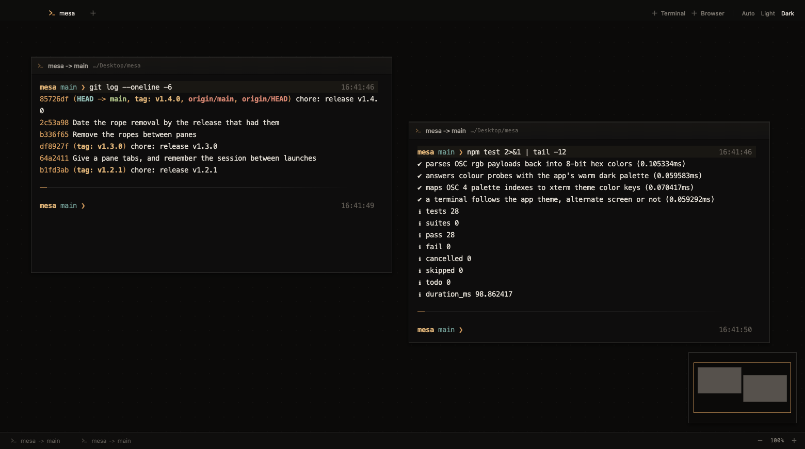

# Mesa

Terminals on an infinite canvas. Put a shell where you want it, leave it there,
and come back to it in the same place tomorrow.



A tabbed terminal makes you remember which tab is which. Mesa gives every
session a *place* instead: drag windows anywhere on an unbounded surface, zoom
out to see the whole workspace, zoom back in to work. Browser panes sit on the
same canvas, so the thing you are building and the page you are checking it on
are side by side rather than behind each other.

## Install

Download the `.dmg` from [Releases](https://github.com/onurkacmaz/mesa/releases)
and drag Mesa to Applications. Apple Silicon only.

The build is **not code-signed**, so macOS will refuse it on first launch. To
open it anyway: right-click the app → **Open** → **Open**. You only do this
once.

## Build from source

```sh
git clone https://github.com/onurkacmaz/mesa.git
cd mesa
npm install
npm run dev      # vite + electron, with devtools
```

Other scripts:

```sh
npm test         # unit tests (node:test, no build needed)
npm run build    # renderer bundle only
npm run dist     # signed-less .dmg into release/
```

`node-pty` builds a native module on install, so you need the Xcode command
line tools (`xcode-select --install`).

## Keys

| | |
|---|---|
| `⌘N` / `⌘B` | new terminal / new browser |
| `⌘1`–`⌘9` | switch tab |
| `⌘T` | new workflow |
| `⌥⌘1`–`⌥⌘9` | switch workflow |
| `⌘W` | close the innermost thing: tab, then window, then workflow |
| `⌘L` | focus a browser pane's address bar |
| `⌘0` / `⇧⌘0` | actual size / fit everything |
| `⌘` + scroll | zoom |
| `space` + drag | pan |

Drag across empty canvas to select several panes; drag a pane by its title bar
to move it.

## What it remembers

Workflows, panes, tabs, the canvas view, every terminal's folder and every
browser's address are written to `session.json` in the app's data directory and
read back on launch.

A pty dies with the app, so a restored terminal is a **fresh shell standing in
the folder it was left in** — the layout comes back, the running processes do
not.

## What it does not do

Worth knowing before you try it:

- **macOS on Apple Silicon only.** There are Windows and Linux branches in the
  code, but nothing is built or tested on either. They are not expected to work
  as-is.
- **The DMG is unsigned and un-notarised.** See the install note above.
- **"Is something running?" needs zsh.** The check that makes `⌘W` ask before
  killing a live command relies on a zsh prompt hook (OSC 133). Under bash,
  fish or anything else, panes close without asking.
- **No agent orchestration, no git worktree management, no task board.** Mesa
  opens shells and puts them somewhere. That is the whole of it.

## How it is put together

Electron, with a React renderer and no framework beyond it.

```
electron/main.js      pty spawning, session file I/O, guest webview policy
electron/preload.js   the entire renderer↔main surface
src/Workspace.jsx     the canvas: pan, zoom, selection, pane lifecycle
src/TerminalPane.jsx  one pane: title bar, tab strip, drag and resize
src/TerminalView.jsx  xterm.js, wired to a pty
src/BrowserView.jsx   a <webview> guest with its own chrome
src/session.mjs       pure: what a session file is, and when to trust it
```

`src/session.mjs` is deliberately free of React and the filesystem, which is
why the part of persistence that can ruin a launch is also the part that is
directly unit-tested.

## Contributing

See [CONTRIBUTING.md](CONTRIBUTING.md). Issues and pull requests are welcome.

## License

[MIT](LICENSE) © Onur Kaçmaz
